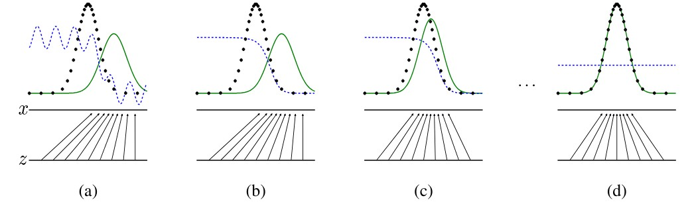
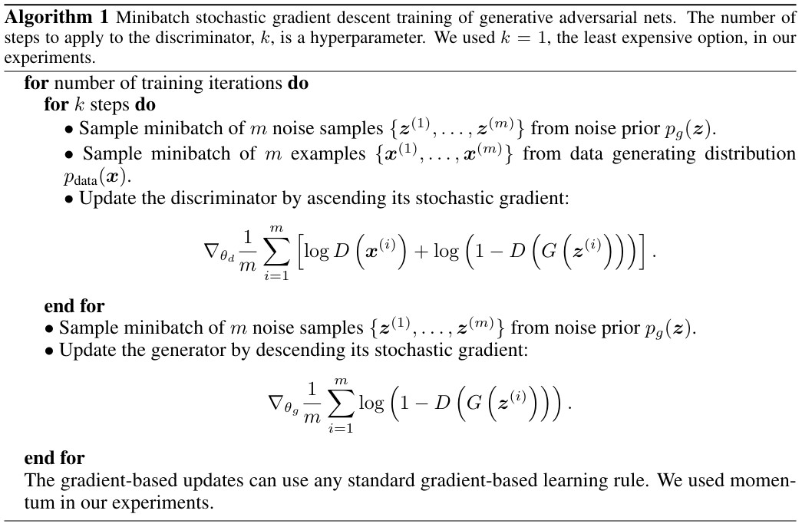
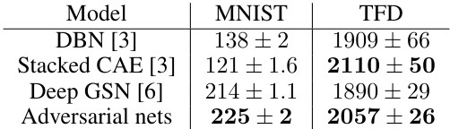

# Keywords
dd

# 1. Introduction
#### - CNN
컴퓨터 비전에서의 모델들은 주로 CNN 기반이 많았음
그리고 CNN architecture들은 더 정교하고 더 복잡하고 더 크고 확장이 가능한 연결형태를 만듦으로써 convolution 형태를 진화시켜왔음
다양한 vision task에서 cnn은 backbone network로 많이 사용되어왔고 많은 분야에서 향상된 성능을 보임

#### - NLP
주로 transformer 기반으로 많이 사용
성능이 좋아서 이를 컴퓨터 비전에도 적용하려는 시도가 있어왔음

#### - nlp에서의 성능을 vision에서도 적용이 가능한가
이 논문에서 저자들은 컴퓨터 비전에서 일반적인 목적으로써 사용가능하도록 Transformer의 적용가능성을 확장시키고자함
nlp에서 사용하는 transfomer를 vision에도 적용시키기에는 어려움
이유 1. scale
이유 2. text보다 image pixel이 더 많은 해상도(정보)를 포함
위 어려움들을 극복하고자 Swin Transformer 제안

#### - Swin Transformer 의 구조에 대한 간략한 설명
계층적 feature map과 이미지 크기에 대한 선형 계산적 복잡도로 구성
계층적 feature map 덕분에 dense prediction에 대한 고급 기술들 적용 가능.
선형 계산 복잡도는 이미지를 겹치지 않는 패치별로 잘라 부분마다 self-attention을 적용함으로써 계산이 가능함.
window마다 patch 수 고정 -> 선형적인 계산 복잡도가 도출

#### - Swin Transformer 의 구조 중 핵심 설계
핵심 디자인 : 연속적인 self attention 층간 window partition의 shift
효과 1. 층간 연결성으로 인해 모델링 파워 강화
효과 2. 실제 세계에서의 연산량에 영향 -> experiment 보면 모델의 파워는 비슷한데 연산량은 더 적음

#### - 그래서 어느 분야에서 강점?
image classification, object detection, sementic segmentation 등

# 2.Methods
## 2.1. Overall Architecture

#### - Input

이미지들을 ViT의 patch들처럼 겹치지 않게 각각 RGB채널마다 나눔
이 떄 각 패치들은 토큰으로 간주되고 이에 대한 feature map은 raw pixel RGB값의 결합?임
여기서는 패치크기를 4x4로 설정해 각 패치마다 feature 차원은 4x4x3(RGB channel)로 구성 
이를 linear embedding 층에 적용하는데 arbitrary dimension $C$로 사영(삽입)함. 
변형된 self-attention 계산(Swin Transformer block)을 이용한 여러 Transformer block들에 앞서 구성한 패치들을 적용한다. 
이때 Transformer block들의 크기는 토큰의 개수인 $\frac{H}{4}$x$\frac{W}{4}$ 이고 이를 Stage1이라고 지칭한다.

#### - Hierarchcial Feature Map
이제 전체적인 구성에서 계층적인 feature map을 구성해야 하므로 신경망이 깊어짐에 따라 patch들을 합쳐 토큰의 수를 감소시켜야한다.

## 2.2. Objects
#### - Generative model $G$ 
원래 데이터 $x$의 분포를 근사할 수 있도록 학습한다. 만약 학습이 잘 되었다면 통계적으로 평균적인 특징을 가지는 데이터를 쉽게 생성 가능하다.

#### - Discriminator model $D$
데이터가 원래 데이터 $x$의 분포에서 나온 것인지, 아니면 $G$의 분포에서 나온 것인지 판별하도록 학습한다. 출력 결과가 1(진짜) 또는 0(가짜)으로 판별한다.

#### - 목표
 

(a) -> (d) 로 시간의 흐름에 따라 진행하면서 생성 모델의 분포가 원본 데이터의 분포를 학습하는 것을 목표로 한다.

## 2.3. Objective Function
$min \atop G$ $ max \atop D$ $V(D,G) = \mathbb{E}_{\bold{x} \sim p_{data}({\bold{x}})} [logD(\bold{x})] + \mathbb{E}_{\bold{z} \sim p_{\bold{z}}({\bold{z}})} [1-logD(G(\bold{z}))]$ 

$\mathbb{E}_{\bold{x} \sim p_{data}({\bold{x}})} [logD(\bold{x})] $ : 원본 데이터 분포에서 샘플 $x$를 뽑아 $logD(x)$의 기댓값을 계산 
    -> 원본 데이터가 진짜(1)인지 가짜(0)인지 구분
    -> $max \atop D$ : 기댓값이 0이 나오도록 구성

$\mathbb{E}_{\bold{z} \sim p_{\bold{z}}({\bold{z}})} [1-logD(G(\bold{z}))]$ : noise variable 분포에서 샘플 $z$를 뽑아 $1-logD(G(z))$의 기댓값을 계산 
    -> 생성모델을 이용해 만든 이미지가 진짜(1)인지 가짜(0)인지 구분 
    -> $D(G(z))$ = 1 -> 기댓값 감소, $D(G(z))$ = 0 -> 기댓값 증가
    -> $min \atop G$ : 기댓값이 0이 나오도록 구성

# 3. Theoritical Results
#### - algorithm 1
미니배치 최적화 진행 알고리즘

## 3.1. Global Optimality of $p_g = p_\bold{data}$
(생성한 이미지와 원본 이미지를 구별하지 않는 경우 또는 구별되지 않는 경우 고려)
#### - Proposition 1 : Optimal Discriminator
고정된 $G$에 대해, 최적의 판별자 D는 다음과 같다. 
$D^{*}_G(\bold{x}) = p_\bold{data}(\bold{x}) / (p_\bold{data}(\bold{x}) + p_g(\bold{x}))$

$Proof$. 주어진 어떤 $G$에 대해,
$V(G,D) = \int_{\bold{x}}p_{data}(\bold{x})log(D(\bold{x})) dx + \int_{\bold{z}}p_{\bold{z}}(\bold{z})log(1-D(g(\bold{x}))) dz$ = $\int_{\bold{x}}p_{data}(\bold{x})log(D(\bold{x})) + p_{g}(\bold{x})log(1-D(\bold{x}))dx$
($\because g(\bold{z}) = \bold{x} $  if  $ p_g = p_\bold{data}$ -> 이미지에 대한 labeling 구분 x)

For any (a,b) $\in \mathbb{R}^2 $ \ {0,0}, the function $F(y) = alog(y) + blog(1-y)$는 $a/(a+b)$ 에서 최대값 [0,1]을 가진다. 따라서 판별 모형은 $Supp(p_{data}) \bigcup Supp(p_{g})$ 에서만 정의되므로 증명이 된다.

#### - Definition : The virtual training criterion $C(G)$

$ C(G) $= $ max \atop D$ $V(G,D) $ 
    $= \mathbb{E}_{\bold{x} \sim p_{data}} [logD^*_G(\bold{x})] + \mathbb{E}_{\bold{z} \sim p_{\bold{z}}} [1-logD^*_G(G(\bold{z}))]$ 
    $= \mathbb{E}_{\bold{x} \sim p_{data}} [logD^*_G(\bold{x})] + \mathbb{E}_{\bold{z} \sim p_{g}} [1-logD^*_G(\bold{x})]$ 
    $= \mathbb{E}_{\bold{x} \sim p_{data}({\bold{x}})} [log (p_{data}(\bold{x})/(p_{data}(\bold{x})+ p_{g}(\bold{x})))] + \mathbb{E}_{\bold{z} \sim p_{\bold{z}}({\bold{z}})} [log (p_{g}(\bold{x})/(p_{data}(\bold{x})+ p_{g}(\bold{x})))]$ 

#### - Theorem 1 : Lower bound of the global minimum
virtual training criterion $C(G)$의 global 최솟값의 필요충분 조건은 $p_g = p_\bold{data}$ 이고, 이 지점에서 $C(G)$의 값은 $-log4$이다.

$Proof$.
$p_g = p_{data}$ 에 대해 Proposition 1에 의해 $D^*_G(\bold{x}) = 1/2$이다. 따라서 $C(G) = log(1/2) + log(1/2) = -log4$ 임을 알 수 있다.  위 정리(가설)에서 $C(G) = V(D^*_G, G)$ 로 표현하면, Jenson-Shannon divergence(JSD)에 의해
$C(G) = -log4 + KL(p_{data}||(p_{data}+ p_{g})/2) + KL(p_{g}||(p_{data}+ p_{g})/2) = -log4 + 2*JSD(p_{data} || p_{g})$ 
임을 알 수 있다. 두 분포간 Jenson-Shannon divergence 는 항상 0이상이고 두 분포가 동일할 때 0이므로, $C(G)$의 global 최솟값은 $-log4$ 임을 알 수 있다.  

## 3.2. Convergence of Algorithm 1
#### - Proposition 2 : Covergence of $p_g$ to $p_x$ 
G와 D가 충분한 용량을 가지고 있고, Algorithm1의 각 단계에서 판별 모델이 주어진 G에 대해 최적 상태에 도달되도록 허용되며, $p_g$가 다음과 같은 기준을 개선하도록 업데이트 된다면,
$\mathbb{E}_{\bold{x} \sim p_{data}({\bold{x}})} [logD^*_G(\bold{x})] + \mathbb{E}_{\bold{z} \sim p_{\bold{z}}({\bold{z}})} [1-logD^*_G(\bold{x})]$ 
$p_g$는 $p_{data}$로 수렴한다.

$Proof.$
$p_g$ 에 대한 기준이 위와 같을 때, $V(G,D) = U(p_g,D)$을 고려해보자. 이 때, $U(p_g,D)$는 $p_g$에 대해 볼록함수이다. 그러면 볼록함수의 상한에 대한 하방미분은 최고점에서의 도함수를 포함한다. 즉, 이는 주어진 G에 대해 최적의 D에서 $p_g$에 대한 gradient descent를 계산하는 것과 동일하다. Theorem 1에서 증명한 바와 같이 $sup_{D}U(p_g,D)$는 $p_g$에 대해 볼록하며 유일한 global 최적점을 가진다. 따라서 충분히 작은 업데이트로도 $p_g$ 가 $p_x$로 수렴하는 것을 알 수 있다.

# 4. Experiments
## 1. Train
#### - Adversarial nets
datasets : MNIST, Toronto Face Database(TFD), CIFAR-10

#### - Generator nets
rectifier linear activation(ReLU), sigmoid activation 사용

#### - Discriminator nets
maxout activation 사용
dropout 적용

## 2. Test
$G$로 생성한 샘플에 Gaussian Parzen window를 맞추어 이 분포 하에서 로그 가능도를 전달함으로써 테스트 데이터의 확률을 $p_g$ 하에서 추정했다. 이 때 Gaussian의 파라미터 $\sigma$는 cross validation을 이용해 최적의 값을 계산해 적용했다.

이 가능도 추정방법은 상당히 높은 분산을 가지고 고차원 데이터에 대한 성능이 좋지 않지만, 최선의 방법이다. 

위 이미지들은 훈련 후 generative nets의 샘플들이다. 기존 방법들보다 우수하다고는 할 수는 없지만 적대적 프레임워크의 잠재력을 제시하며 우수한 생성 모델들과 경쟁이 가능하다고 본다.

# 5. Advantages and Disadvantages
#### - 장점
1. Markov chain이 필요하지않다.
2. 오직 역전파만을 이용해 기울기를 계산한다.
3. train 중 추론이 필요없으며 다양한 함수를 모델에 통합가능하다.
4. 주로 계산적인 측면에서 강점을 보인다.

#### - 단점
1. $p_g$에 대한 명시적 표현이 없다.
2. 훈련 중 $D$와 $G$가 잘 동기화되어야한다. $G$가 $D$를 잘 업데이트하지 않은 채로 훈련하게 되면, $p_{data}$를 모델링하기에는 다양성이 부족해지는 현상이 발생한다.

# 6. Conclusions and Future works 
1. 조건부 생성 모델 $p(\bold{x}|\bold{c})$는 $\bold{c}$를 $G$와 $D$ 모두에 입력으로 추가해 얻을 수 있다.
2. 학습된 근사 추론은 $\bold{x}$가 주어졌을 때 $\bold{z}$를 예측하기 위해 보조 네트워크를 훈련함으로써 수행 가능하다.
3. $S$ 가 $\bold{x}$의 인덱스들의 하위 집합일때, 모든 조건부 $p(\bold{x}_S | \bold{x}_{\not{S}})$에 대해 매개변수를 공유하는 모든 조건부 모델 종류를 훈련해 대략적으로 모델링할 수 있다.
4. seim-supervised 학습 : 판별 모델 또는 추론 신경망에서 얻은 특징은 제한된 labeling 데이터가 있을 때 분류기의 성능을 향상할 수 있다.
5. 효율성 개선 : $G$와 $D$를 조정하는 더 나은 방법을 고안하거나 훈련 중 샘플링할 $\bold{z}$의 더 나은 분포를 결정함으로써 훈련 속도를 크게 증가할 수 있다.

# 참고
[GAN: Generative Adversarial Networks (꼼꼼한 딥러닝 논문 리뷰와 코드 실습)]
https://www.youtube.com/watch?v=AVvlDmhHgC4&t=2020s

[Jensen-Shannon Divergence]
https://ddongwon.tistory.com/118